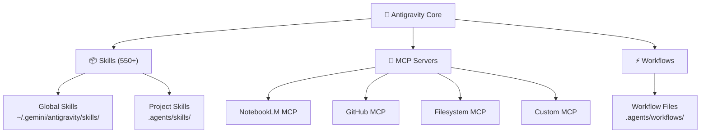
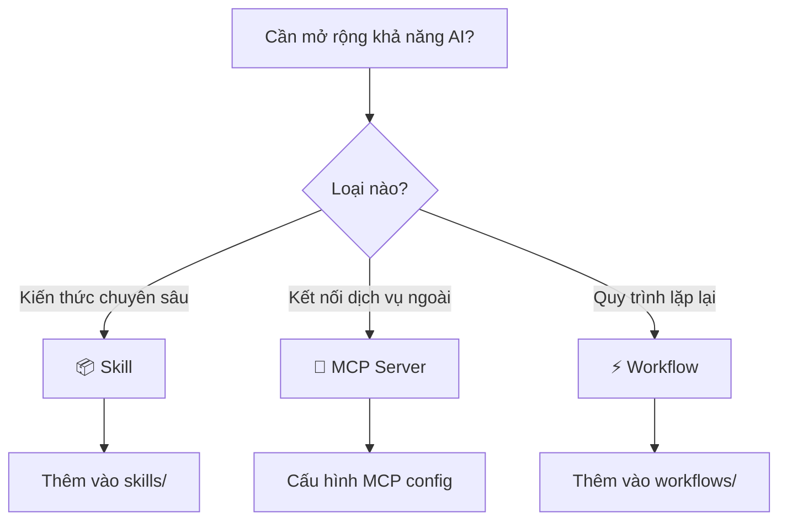

# 🧩 Hướng Dẫn Tích Hợp Skills & Extensions vào Antigravity IDE

> **Phiên bản:** 1.0 — Cập nhật: 2026-03-18
> **Mục tiêu:** Hướng dẫn toàn diện cách thêm, cấu hình, và sử dụng các Skill, Extension, MCP Server vào hệ thống Antigravity IDE.

---

## 📋 Mục lục

1. [Tổng quan kiến trúc](#1-tổng-quan-kiến-trúc)
2. [Các loại tích hợp](#2-các-loại-tích-hợp)
3. [Tích hợp Skills (Office Viewer, PDF, PPTX, DOCX, XLSX)](#3-tích-hợp-skills)
4. [Tích hợp MCP Servers](#4-tích-hợp-mcp-servers)
5. [Tích hợp Workflows](#5-tích-hợp-workflows)
6. [Tạo Skill tùy chỉnh](#6-tạo-skill-tùy-chỉnh)
7. [Best Practices](#7-best-practices)
8. [Troubleshooting](#8-troubleshooting)

---

## 1. Tổng quan kiến trúc

Antigravity IDE sử dụng kiến trúc modular với **3 lớp mở rộng**:



### Thư mục quan trọng

| Thư mục | Mục đích | Phạm vi |
|---------|----------|---------|
| `~/.gemini/antigravity/skills/` | Skills toàn cục, dùng cho mọi project | Global |
| `.agents/skills/` | Skills riêng cho project hiện tại | Project |
| `.agents/workflows/` | Workflow commands (`/slash-command`) | Project |
| `.agents/rules/` | Rules & conventions | Project |

---

## 2. Các loại tích hợp

### 2.1. Skills — Khối kiến thức chuyên biệt

Skills là các "gói kiến thức" cung cấp cho AI khả năng chuyên sâu trong một lĩnh vực cụ thể.

**Cấu trúc một Skill:**
```
skill-name/
├── SKILL.md          # 📄 File chính (BẮT BUỘC) — YAML frontmatter + hướng dẫn
├── sub-skills/       # 📂 Fractal sub-skills (tùy chọn)
│   ├── module-a.md
│   └── module-b.md
├── scripts/          # 🔧 Helper scripts (tùy chọn)
├── examples/         # 📝 Ví dụ tham khảo (tùy chọn)
└── resources/        # 📁 Tài nguyên bổ sung (tùy chọn)
```

**YAML Frontmatter bắt buộc trong `SKILL.md`:**
```yaml
---
name: my-skill-name
description: "Mô tả ngắn gọn khi nào và tại sao nên dùng skill này"
---
```

### 2.2. MCP Servers — Kết nối dịch vụ bên ngoài

MCP (Model Context Protocol) cho phép AI kết nối với các dịch vụ bên ngoài như NotebookLM, GitHub, Database...

### 2.3. Workflows — Quy trình tự động hóa

Workflows là các quy trình định sẵn được kích hoạt qua slash commands (`/skill-generate`, `/project-status`, v.v.)

---

## 3. Tích hợp Skills

### 3.1. Skills Office Viewer đã có sẵn

Antigravity IDE đã tích hợp sẵn bộ **4 Office Skills** chính:

#### 📄 DOCX Skill (`docx-official`)
**Vị trí:** `~/.gemini/antigravity/skills/docx-official/`

**Khả năng:**
- Tạo mới document Word
- Đọc/phân tích nội dung `.docx`
- Chỉnh sửa document có sẵn
- Trích xuất text
- Truy cập Raw XML
- Hỗ trợ Tracked Changes

**Cách dùng:** AI tự kích hoạt khi bạn yêu cầu làm việc với file `.docx`
```
"Tạo file Word báo cáo cuối kỳ"
"Đọc nội dung file report.docx"
"Thêm table vào file Word"
```

#### 📊 XLSX Skill (`xlsx-official`)
**Vị trí:** `~/.gemini/antigravity/skills/xlsx-official/`

**Khả năng:**
- Tạo/chỉnh sửa file Excel với `openpyxl`
- Phân tích dữ liệu với `pandas`
- Dùng formulas thay vì hardcode
- Recalculate formulas với `recalc.py` + LibreOffice
- Color coding chuẩn tài chính

**Cách dùng:**
```
"Tạo bảng tính lương nhân viên"
"Phân tích dữ liệu từ file DS.xlsx"
"Thêm công thức SUM vào cột tổng"
```

#### 📑 PPTX Skill (`pptx-official`)
**Vị trí:** `~/.gemini/antigravity/skills/pptx-official/`

**Khả năng:**
- Tạo presentation mới
- Chỉnh sửa nội dung slides
- Làm việc với layouts
- Thêm speaker notes & comments
- Trích xuất text và Raw XML

**Cách dùng:**
```
"Tạo slide thuyết trình về dự án"
"Chỉnh sửa nội dung slide 3"
"Thêm ghi chú cho người trình bày"
```

#### 📕 PDF Skill (`pdf-official`)
**Vị trí:** `~/.gemini/antigravity/skills/pdf-official/`

**Khả năng:**
- Đọc & trích xuất text (`pypdf`)
- Trích xuất bảng (`pdfplumber`)
- Tạo PDF mới (`reportlab`)
- Gộp/tách PDF
- OCR cho scanned PDFs
- Thêm watermark, extract ảnh, mật khẩu

**Cách dùng:**
```
"Đọc nội dung file hợp đồng.pdf"
"Gộp 3 file PDF lại thành 1"
"Trích xuất bảng dữ liệu từ PDF"
```

### 3.2. Cách thêm Skill mới từ GitHub

**Phương pháp 1: Cập nhật toàn bộ từ repo chính**
```bash
# Cập nhật tất cả skills từ repo Antigravity chính thức
npx antigravity-ide@latest update
```

> [!NOTE]
> Lệnh này sẽ sync skills từ `~/.antigravity/skills/` → `~/.gemini/antigravity/skills/`
> và giữ nguyên các custom skills đã có.

**Phương pháp 2: Thêm skill thủ công**

```bash
# 1. Clone hoặc download skill
git clone https://github.com/user/my-skill.git /tmp/my-skill

# 2. Copy vào thư mục skills
# Global (mọi project):
cp -r /tmp/my-skill ~/.gemini/antigravity/skills/my-skill

# Project-specific:
cp -r /tmp/my-skill .agents/skills/my-skill
```

### 3.3. Cài đặt dependencies cho Office Skills

Một số Office skills cần Python packages:

```bash
# PDF processing
pip install pypdf pdfplumber reportlab

# Excel processing  
pip install openpyxl pandas

# Word processing
pip install python-docx lxml

# PowerPoint processing
pip install python-pptx

# (Tùy chọn) LibreOffice cho formula recalculation
# Windows: Cài từ https://www.libreoffice.org/download/
# LibreOffice sẽ tự cấu hình khi recalc.py chạy lần đầu
```

---

## 4. Tích hợp MCP Servers

### 4.1. MCP Servers đã tích hợp

| MCP Server | Chức năng | Tools chính |
|-----------|----------|-------------|
| **NotebookLM** | Truy cập Google NotebookLM | `notebook_query`, `research_start`, `audio_overview_create` |
| **GitHub** | Quản lý repository | Issues, PRs, Commits |
| **Filesystem** | Thao tác file system | Read, Write, Search |
| **Puppeteer** | Browser automation | Navigate, Click, Screenshot |
| **Notion** | Notion workspace | Pages, Databases |
| **PostgreSQL** | Database queries | SQL execution |

### 4.2. Sử dụng NotebookLM MCP

NotebookLM MCP cho phép tạo notebook, thêm nguồn, truy vấn AI, và tạo nội dung (audio, video, slides, infographic).

**Xác thực:**
```bash
# Phương pháp 1: CLI tự động (ưu tiên)
notebooklm-mcp-auth

# Phương pháp 2: Refresh token
# Gọi tool: mcp_notebooklm_refresh_auth
```

**Workflow cơ bản:**
```
1. Tạo notebook     → mcp_notebooklm_notebook_create
2. Thêm nguồn       → notebook_add_url / notebook_add_text / notebook_add_drive
3. Truy vấn          → notebook_query
4. Tạo nội dung      → audio_overview_create / slide_deck_create / report_create
5. Kiểm tra tiến độ  → studio_status
```

**Ví dụ thực tế:**
```
"Tạo notebook về dự án ABC"
"Thêm URL https://... vào notebook"
"Hỏi notebook: Tóm tắt nội dung chính?"
"Tạo podcast từ notebook này"
```

### 4.3. Cấu hình MCP Server mới

MCP Servers được cấu hình trong Antigravity IDE settings. Mỗi server cần:

| Tham số | Mô tả |
|---------|-------|
| `command` | Lệnh chạy server |
| `args` | Tham số dòng lệnh |
| `env` | Biến môi trường (API keys) |

> [!IMPORTANT]
> API keys phải được lưu trong biến môi trường, KHÔNG hardcode trong config.

---

## 5. Tích hợp Workflows

### 5.1. Workflows hiện có

| Slash Command | Mô tả |
|--------------|-------|
| `/best-practices` | Tra cứu Claude Code best practices |
| `/project-status` | Xem tổng quan dự án |
| `/skill-generate` | Tạo skill mới qua phỏng vấn 5 Phase |
| `/skill-scaffold` | Tạo skeleton skill nhanh |
| `/skill-validate` | Kiểm tra SKILL.md hợp lệ |
| `/skill-audit` | Audit skill theo 7 nguyên tắc |
| `/skill-compare` | So sánh 2 phiên bản skill |
| `/skill-export` | Export skill ra nền tảng khác |
| `/skill-simulate` | Mô phỏng chạy thử skill |
| `/skill-stats` | Xem thống kê & Cognitive Load |

### 5.2. Tạo Workflow mới

Tạo file `.md` trong `.agents/workflows/`:

```markdown
---
description: Mô tả ngắn gọn workflow
---

# Tên Workflow

## Bước 1: ...
Hướng dẫn chi tiết bước 1

## Bước 2: ...
// turbo
Bước này sẽ tự động chạy (nếu là run_command)

## Bước 3: ...
Tiếp tục...
```

**Annotations đặc biệt:**
- `// turbo` — Tự động chạy bước đó (không cần confirm)
- `// turbo-all` — Tự động chạy TẤT CẢ bước

---

## 6. Tạo Skill tùy chỉnh

### 6.1. Quick Scaffold (nhanh nhất)

```
/skill-scaffold
```

Tạo skeleton skill với cấu trúc chuẩn trong vài giây.

### 6.2. Full Generate (chất lượng cao)

```
/skill-generate
```

Pipeline 5 Phase:
1. 🎤 **Phỏng vấn** — AI hỏi về công việc bạn muốn tự động hóa
2. 🔬 **Trích xuất** — Cấu trúc hóa thông tin
3. 🔎 **Pattern Detection** — Chọn kiến trúc phù hợp
4. 🏗️ **Sinh package** — Tạo đầy đủ files
5. 🧪 **Test & Refine** — Đảm bảo chất lượng

### 6.3. Tạo thủ công

**Bước 1:** Tạo thư mục

```bash
mkdir -p .agents/skills/my-custom-skill/sub-skills
```

**Bước 2:** Tạo `SKILL.md`

```markdown
---
name: my-custom-skill
description: "Mô tả skill — khi nào trigger, keyword nào"
---

# Tên Skill

## Overview
Mô tả tổng quan skill làm gì.

## When to Use
- Keyword 1: "..."
- Keyword 2: "..."

## Workflow
1. Bước 1...
2. Bước 2...

## 🧠 Knowledge Modules (Fractal Skills)
### 1. [Module A](./sub-skills/module-a.md)
### 2. [Module B](./sub-skills/module-b.md)
```

**Bước 3:** Kiểm tra

```
/skill-validate
```

### 6.4. Nguyên tắc viết Skill hiệu quả

| Nguyên tắc | Mô tả |
|-----------|-------|
| **Concise** | Ngắn gọn, tránh dài dòng. AI đọc mỗi lần gọi |
| **Progressive Disclosure** | SKILL.md ngắn → link tới sub-skills chi tiết |
| **Clear Triggers** | Mô tả rõ khi nào skill được kích hoạt |
| **Single Responsibility** | Một skill = một chủ đề/domain |
| **Fractal Structure** | Chia nhỏ thành sub-skills cho kiến thức sâu |

---

## 7. Best Practices

### 7.1. Tổ chức Skills

```
✅ Nên:
- Đặt skills dùng chung → ~/.gemini/antigravity/skills/ (global)
- Đặt skills riêng project → .agents/skills/ (project-scoped)
- Mỗi skill một thư mục riêng
- SKILL.md luôn ở root của thư mục

❌ Không nên:
- Trộn lẫn skills chung và riêng
- SKILL.md quá dài (>500 dòng) → dùng sub-skills
- Hardcode API keys trong SKILL.md
```

### 7.2. Khi nào dùng cái gì?



| Cần | Dùng | Ví dụ |
|-----|------|-------|
| Xử lý file Office | **Skill** (docx, xlsx, pptx, pdf) | Tạo báo cáo Word, phân tích Excel |
| Truy vấn NotebookLM | **MCP Server** | Tìm thông tin từ tài liệu đã upload |
| Tạo skill mới tự động | **Workflow** (`/skill-generate`) | Tự động hóa quy trình lặp lại |
| Tạo landing page | **Skill** + **Workflow** | UI/UX skill + deploy workflow |

### 7.3. Cập nhật & Bảo trì

```bash
# Cập nhật skills từ repo chính
npx antigravity-ide@latest update

# Kiểm tra skill đã có
/project-status

# Audit chất lượng skill
/skill-audit

# Xem thống kê
/skill-stats
```

---

## 8. Troubleshooting

### 8.1. Skill không được kích hoạt

| Nguyên nhân | Giải pháp |
|-------------|-----------|
| SKILL.md thiếu YAML frontmatter | Thêm `---` block với `name` và `description` |
| Thư mục sai vị trí | Kiểm tra lại path (`skills/` hoặc `.agents/skills/`) |
| Description không rõ ràng | Viết lại description với keywords cụ thể |

### 8.2. MCP Server lỗi xác thực

```bash
# NotebookLM: Chạy lại auth
notebooklm-mcp-auth

# Hoặc refresh từ trong chat
# Gọi tool: mcp_notebooklm_refresh_auth
```

### 8.3. Office Skill thiếu dependencies

```bash
# Kiểm tra Python packages
pip list | grep -i "pypdf\|openpyxl\|pdfplumber\|python-docx\|python-pptx"

# Cài thiếu
pip install pypdf openpyxl pdfplumber python-docx python-pptx reportlab pandas
```

### 8.4. Workflow không chạy

| Vấn đề | Giải pháp |
|--------|-----------|
| File không tìm thấy | Đảm bảo file nằm trong `.agents/workflows/` |
| Thiếu frontmatter | Thêm `description` trong YAML block |
| Tên file sai | Dùng kebab-case: `my-workflow.md` |
| Slash command sai | Tên file = slash command: `/my-workflow` → `my-workflow.md` |

---

## 📊 Tổng kết nhanh

| Thành phần | Số lượng | Vị trí |
|------------|---------|--------|
| **Global Skills** | 580+ | `~/.gemini/antigravity/skills/` |
| **Project Skills** | Tùy project | `.agents/skills/` |
| **MCP Servers** | 6 tích hợp sẵn | Config trong IDE |
| **Workflows** | 10 có sẵn | `.agents/workflows/` |
| **Office Skills** | 4 (DOCX, XLSX, PPTX, PDF) | Trong global skills |

> [!TIP]
> **Cách nhanh nhất để bắt đầu:** Chỉ cần nói với AI bạn muốn làm gì. Nếu có skill phù hợp, nó sẽ tự kích hoạt. Nếu không, dùng `/skill-generate` để tạo skill mới!
